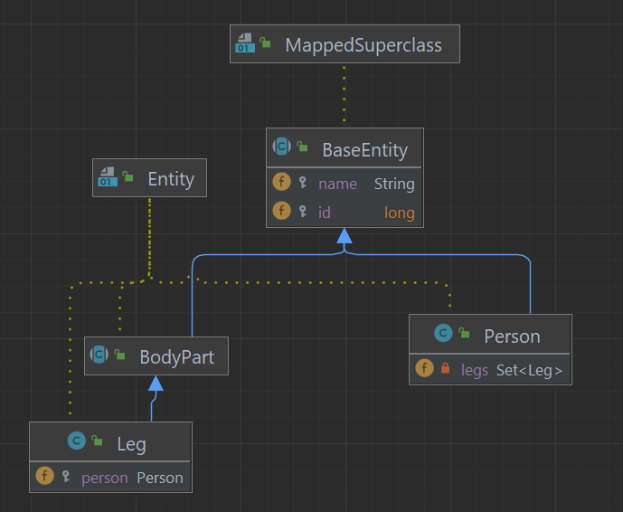
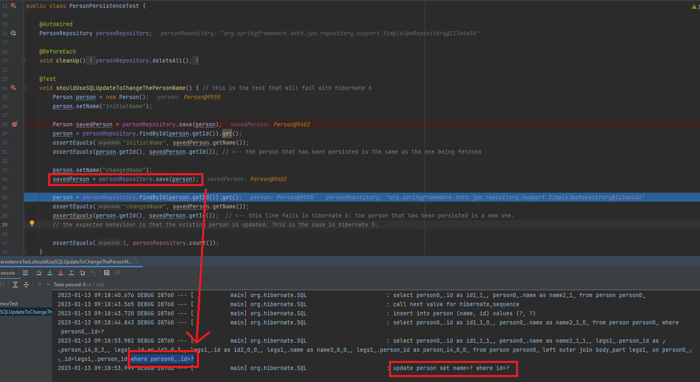
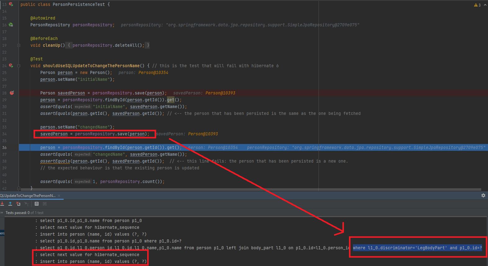

# Possible hibernate 6 bug

## Requisites

- entity ("Person") exists that has a field which is a set of other entities ("Set\<Leg>")
- these other entities are derived from an abstract super class ("Leg extends BodyPart")
- the abstract super class' inheritance strategy is SINGLE_TABLE

## Reproduction

- execute the test PersonPersistenceTest.shouldUseSQLUpdateToChangeThePersonName
- the test basically
  - creates a Person (without Legs) and saves it using the repository
  - refetches the Person by findById
  - changes the Person's name
  - saves the changed Person again

## Observations in Hibernate 5.6.14.Final

- when the second save is called (after changing the name) there will be a select statement which is used to check if the entity already exists
  - the body_part table is joined via left outer join
  - the where clause here only consists of "where person.id = \<id>"
- the entity is correctly found by the select statement so afterwards an update statement follows
- result: one entity exists (the changed one)

## Observations in Hibernate 6.1.6.Final

- when the second save is called (after changing the name) there will be a different select statement now
  - the body_part table is joined via left join now (not outer)
  - the critical change here is that the where clause now suddenly consists of "where body_part.discriminator = 'LegBodyPart' and person.id = \<id>"
- although the entity exists, it is not found by the select statement so afterwards an insert statement follows which creates a second Person with a new id
- result: two entities exist (the original one and the changed one)

# Summary

- after updating spring boot to 3.0.1 which also updates hibernate to 6.1.6.Final it does not seem to be possible to update an entity with this constellation
- the main difference is that an additional and unexpected where clause is added which prevents finding the correct entity in this case
- the result is that a new entity is persisted instead of the existing one being updated